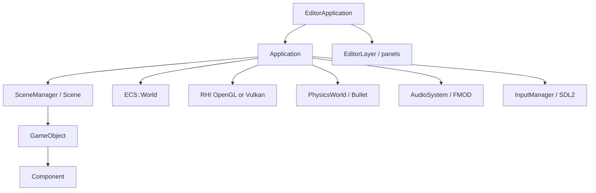

# Architecture

Four ideas. Every other subsystem hangs off them.

| Idea | What it owns |
| --- | --- |
| `Application` | Window, graphics device, loop, coordination |
| `Scene` / `SceneManager` | The active `GameObject`s and scene changes |
| `Component` | Rendering, physics, audio, scripts, UI |
| `ECS::World` | Optional data-oriented registry beside the scene |



## Why it is not pure ECS

The Inspector, prefabs, reflection, the Script Bridge, and Bullet user pointers are `GameObject*`. Moving all authoring onto entities would break that surface and would not help a character, a button, or a light. ECS is for the case where a virtual `OnUpdate` per unit does not scale: many identical projectiles.

The usual bridge:

1. Gameplay takes a prefab from the `ObjectPool` (`GameObject` + game component).
2. When flight starts, an `Entity` is created with `LocalTransform` and flight state.
3. While the entity is alive, the scene component's `OnUpdate` does not integrate motion.
4. After `Scene::Update`, `World::Tick(Simulation)` integrates and queries physics.
5. `OnLateUpdate` reads the hit and applies damage, VFX, and audio.
6. `Tick(Presentation)` copies the ECS position onto the visual `Transform`.

On scene unload, `World::Clear` destroys entities. Registered systems stay for the next scene.

## Editor on top of the SDK

```text
EditorApplication
├── RTBEngine::Core::Application
└── EditorLayer
    ├── Toolbar
    ├── Scene Hierarchy
    ├── Scene View + Game View
    ├── Inspector
    ├── Content Browser
    └── Console
```

In **Edit**, game scripts and physics do not run. In **Play**, `Application::Update` advances the scene, physics, and audio. In **Pause**, runtime state is kept and time is frozen. **Stop** clears the selection and reloads the scene from disk.

## Initialization

Inside `Application::Initialize()` the practical order is window, graphics device, `ResourceManager`, audio, and `SceneManager` callbacks. Bullet bodies are created per scene in `InitializePhysicsForScene`, after the scene is populated. A scene change requested from `OnStart` or `OnUpdate` is deferred to a safe point in the frame (`RequestSceneLoad`).

Shutdown reverses the order: unload the scene, audio, resources, window.

## Namespaces you will see

| Namespace | Contents |
| --- | --- |
| `RTBEngine::Core` | Application, Window, Logger, ResourceManager |
| `RTBEngine::Scene` | GameObject, Component, Scene, prefabs |
| `RTBEngine::ECS` | World, Entity, systems |
| `RTBEngine::Rendering` | Camera, mesh, shader, lights, RHI |
| `RTBEngine::Physics` | Bullet world, colliders, `CollisionInfo` |
| `RTBEngine::Input` | `InputManager`, `KeyCode` |
| `RTBEngine::Animation` | `Animator`, clips, skeleton |
| `RTBEngine::UI` | Canvas, buttons, text |
| `RTBEngine::Online` | `OnlineSystem`, lobby, transport |
| `RTBEngine::Reflection` | `TypeInfo`, `RTB_*` macros |
| `RTBEngine::Math` | Vector, Quaternion, Matrix4, Color |
