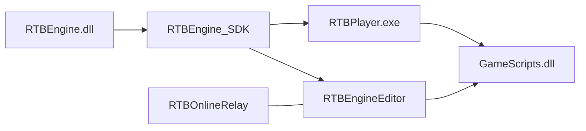

# What is RTBEngine

RTBEngine is a Windows 3D engine written in **C++17**. It builds as `RTBEngine.dll` plus `RTBEngine.lib`. The editor and the player do not link the engine sources: they consume the SDK produced by `BuildSDK.bat`.

It includes a GameObject–Component scene, a sparse ECS for dense simulation, an **OpenGL and Vulkan** RHI, shadows, DDGI, volume fog, Bullet physics, FMOD audio, SDL2 input, skeletal animation, Lua scene serialization, and macro-driven reflection for the Inspector.

## Repositories

| Repository | Role |
| --- | --- |
| `RTBEngine` | Engine, public headers, `BuildSDK.bat` |
| `RTBEngineEditor` | Editor, game assets, `GameScripts` |
| `RTBOnlineRelay` | .NET lobby server and UDP relay |

## Versions that must match

| Constant | Value | Where |
| --- | --- | --- |
| Engine | `1.0.0` | `Engine/Core/Version.h` |
| Editor | `1.0.0` | `Source/Core/EditorVersion.h` |
| RTBN protocol | `4` | `Engine/Online/OnlineMessageCodec.h` |
| Script Bridge ABI | `4` | `Engine/Scripting/ScriptBridgeABI.h` |
| Navmesh format | `1` | `Engine/Navigation/NavMeshFile.cpp` |

When public headers, reflection macros, or the bridge change, build in this order: engine, SDK, `GameScripts`, editor. An old SDK next to a new DLL breaks component registration on load.

## Two models, one game

| | `RTBEngine::Scene` | `RTBEngine::ECS` |
| --- | --- | --- |
| Unit | `GameObject` + `Component` | `Entity` + POD components |
| Update | virtual `OnUpdate` | systems over sparse sets |
| Hierarchy | parent / children | flat `LocalTransform` |
| Authoring | Inspector, prefab, Lua | code |
| Use it for | characters, UI, lights, props | hundreds of identical short-lived units |

ECS does not replace the scene. A projectile can still be a pooled prefab `GameObject` and, while it flies, move as an `Entity`. On impact, the scene component reads the result and applies damage, VFX, and audio.

## What you edit

- `.lua` scenes in `Assets/Scenes/`
- `.prefab` files in `Assets/Prefabs/`
- C++ scripts in `Assets/Scripts/`, compiled into `GameScripts.dll`
- The `.rtbproj` project file and lighting in `lighting.ini`

The editor is documented in [The interface](../editor/interfaz.md). The practical first pass is [Your first game](primer-juego.md).
