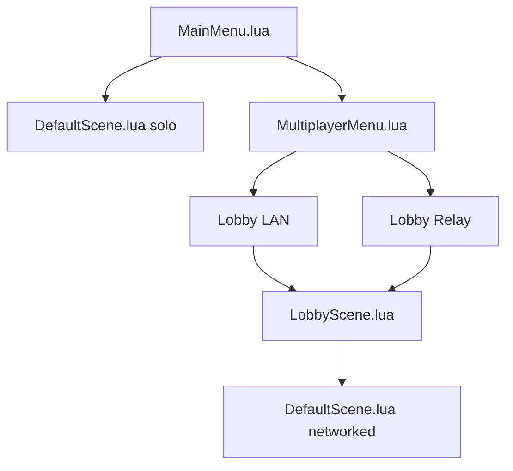

# Online

Multiplayer uses the SDK: identity, lobby, and transport in `RTBEngine::Online`, the `NetworkIdentity` and `NetworkTransform` components in the scene, and the menu logic in `GameScripts`.

There are two lobby backends. Both can be initialized at the same time. The menu chooses which one the session uses with `OnlineSystem::SetSessionLobbyBackend`.

| Scene | Who is in charge |
| --- | --- |
| `MainMenu.lua` | Play, Multiplayer, name |
| `MultiplayerMenu.lua` | LAN or Online |
| `LobbyScene.lua` | Create, join, the host presses Start |
| `DefaultScene.lua` | The match. `OnlinePlayerManager` comes before the player pawn |

During a match, Tab opens pause without stopping the game. Resume closes the menu. Exit returns to the main menu and, if there was a network session, tells the others.

## Pieces

| Piece | Where it is documented |
| --- | --- |
| Two PCs on the same network | [LAN match](lan.md) |
| Internet through the server | [Internet relay](relay.md) |
| What gets replicated | [Network messages](mensajes.md) |
| Classes | [Online](../api/online.md) and [Network](../api/network.md) |

The **Window → Online** panel stores `EditorOnlineSettings.json`: enabled, game port, discovery port, matchmaking URL, and the test-launcher scene. It does not replace the game menu.
