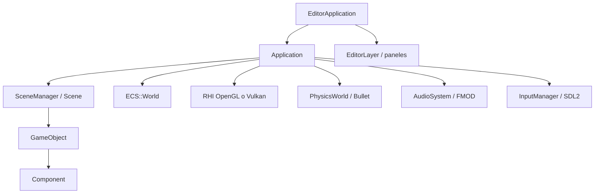

# Arquitectura

Hay cuatro ideas. El resto de subsistemas cuelga de ellas.

| Idea | Qué posee |
| --- | --- |
| `Application` | Ventana, dispositivo gráfico, bucle, coordinación |
| `Scene` / `SceneManager` | Los `GameObject` activos y el cambio de escena |
| `Component` | Render, física, audio, scripts, UI |
| `ECS::World` | Registro data-oriented opcional, al lado de la escena |



## Por qué no es ECS puro

El Inspector, los prefabs, la reflexión, el Script Bridge y los punteros de Bullet apuntan a `GameObject*`. Pasar todo el autorado a entidades rompería esa superficie sin ganar nada en un personaje, un botón o una luz. El ECS entra donde el `OnUpdate` virtual no escala: muchos proyectiles iguales.

El puente típico:

1. El gameplay saca un prefab del `ObjectPool` (`GameObject` + componente de juego).
2. Al empezar el vuelo se crea un `Entity` con `LocalTransform` y el estado de vuelo.
3. Mientras la entidad vive, el `OnUpdate` del componente de escena no integra el movimiento.
4. Tras `Scene::Update`, `World::Tick(Simulation)` integra y consulta física.
5. `OnLateUpdate` lee el impacto y aplica daño, VFX y audio.
6. `Tick(Presentation)` copia la posición ECS al `Transform` visual.

Al descargar la escena, `World::Clear` borra entidades. Los sistemas registrados siguen para la siguiente.

## Editor encima del SDK

```text
EditorApplication
├── RTBEngine::Core::Application
└── EditorLayer
    ├── Toolbar
    ├── Scene Hierarchy
    ├── Scene View + Game View
    ├── Inspector
    ├── Content Browser
    └── Console
```

En **Edit**, los scripts y la física de juego no corren. En **Play**, `Application::Update` avanza escena, física y audio. En **Pause**, el estado se conserva y el tiempo está parado. **Stop** limpia la selección y recarga la escena desde disco.

## Inicialización

Dentro de `Application::Initialize()` el orden práctico es ventana, dispositivo gráfico, `ResourceManager`, audio y callbacks de `SceneManager`. La física de Bullet se crea por escena en `InitializePhysicsForScene`, cuando la escena ya está poblada. Por eso un cambio de escena pedido desde `OnStart` o `OnUpdate` se aplaza a un punto seguro del frame (`RequestSceneLoad`).

El apagado invierte el orden: descargar escena, audio, recursos, ventana.

## Namespaces que vas a ver

| Namespace | Contenido |
| --- | --- |
| `RTBEngine::Core` | Application, Window, Logger, ResourceManager |
| `RTBEngine::Scene` | GameObject, Component, Scene, prefabs |
| `RTBEngine::ECS` | World, Entity, sistemas |
| `RTBEngine::Rendering` | Cámara, malla, shader, luces, RHI |
| `RTBEngine::Physics` | Mundo Bullet, colliders, `CollisionInfo` |
| `RTBEngine::Input` | `InputManager`, `KeyCode` |
| `RTBEngine::Animation` | `Animator`, clips, esqueleto |
| `RTBEngine::UI` | Canvas, botones, texto |
| `RTBEngine::Online` | `OnlineSystem`, lobby, transporte |
| `RTBEngine::Reflection` | `TypeInfo`, macros `RTB_*` |
| `RTBEngine::Math` | Vector, Quaternion, Matrix4, Color |
