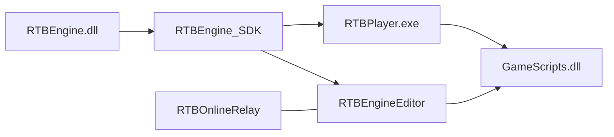

# Qué es RTBEngine

RTBEngine es un motor 3D de Windows escrito en **C++17**. Se compila como `RTBEngine.dll` más `RTBEngine.lib`. El editor y el player no enlazan el código fuente del motor: consumen el SDK generado por `BuildSDK.bat`.

Incluye escena de GameObject y Component, un ECS disperso para simulación densa, RHI **OpenGL y Vulkan**, sombras, DDGI, niebla por volumen, física Bullet, audio FMOD, input SDL2, animación esquelética, serialización de escenas en Lua y reflexión por macros para el Inspector.

## Repositorios

| Repositorio | Rol |
| --- | --- |
| `RTBEngine` | Motor, headers públicos, `BuildSDK.bat` |
| `RTBEngineEditor` | Editor, assets del juego, `GameScripts` |
| `RTBOnlineRelay` | Servidor .NET de lobbies y relay UDP |

## Versiones que tienen que coincidir

| Constante | Valor | Dónde |
| --- | --- | --- |
| Motor | `1.0.0` | `Engine/Core/Version.h` |
| Editor | `1.0.0` | `Source/Core/EditorVersion.h` |
| Protocolo RTBN | `4` | `Engine/Online/OnlineMessageCodec.h` |
| Script Bridge ABI | `4` | `Engine/Scripting/ScriptBridgeABI.h` |
| Formato navmesh | `1` | `Engine/Navigation/NavMeshFile.cpp` |

Si cambias headers públicos, macros de reflexión o el bridge, el orden de compilación es motor, SDK, `GameScripts`, editor. Un SDK viejo con una DLL nueva rompe el registro de componentes al cargar.

## Dos modelos, un juego

| | `RTBEngine::Scene` | `RTBEngine::ECS` |
| --- | --- | --- |
| Unidad | `GameObject` + `Component` | `Entity` + componentes POD |
| Update | `OnUpdate` virtual | sistemas sobre sparse sets |
| Jerarquía | padre / hijos | `LocalTransform` plano |
| Autorado | Inspector, prefab, Lua | código |
| Sirve para | personajes, UI, luces, props | cientos de unidades iguales y cortas |

El ECS no sustituye la escena. Un proyectil puede seguir siendo un prefab con `GameObject` y, mientras vuela, moverse en un `Entity`. Al impactar, el componente de escena lee el resultado y aplica daño, VFX y audio.

## Qué editas tú

- Escenas `.lua` en `Assets/Scenes/`
- Prefabs `.prefab` en `Assets/Prefabs/`
- Scripts C++ en `Assets/Scripts/`, compilados a `GameScripts.dll`
- Proyecto `.rtbproj` e iluminación en `lighting.ini`

El editor está documentado en [La interfaz](../editor/interfaz.md). El primer recorrido práctico está en [Tu primer juego](primer-juego.md).
