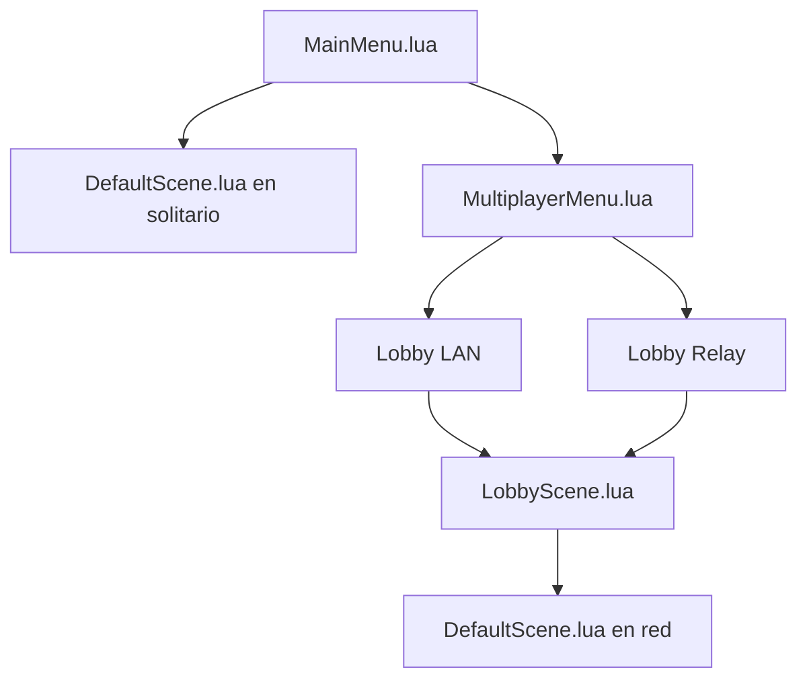

# Online

El multijugador usa el SDK: identidad, lobby y transporte en `RTBEngine::Online`, componentes `NetworkIdentity` y `NetworkTransform` en la escena, y la lógica de menú en `GameScripts`.

Hay dos backends de lobby. Los dos pueden estar inicializados a la vez. El menú elige cuál usar en la sesión con `OnlineSystem::SetSessionLobbyBackend`.

| Escena | Quién manda |
| --- | --- |
| `MainMenu.lua` | Play, Multiplayer, nombre |
| `MultiplayerMenu.lua` | LAN o Online |
| `LobbyScene.lua` | Crear, unir, el host pulsa Start |
| `DefaultScene.lua` | Partida. `OnlinePlayerManager` antes que el peón del jugador |

En la partida, Tab abre la pausa sin frenar el juego. Resume cierra el menú. Exit vuelve al menú principal y, si había red, avisa al resto.

## Piezas

| Pieza | Dónde se documenta |
| --- | --- |
| Dos PCs en la misma red | [Partida en LAN](lan.md) |
| Internet a través del servidor | [Relay de Internet](relay.md) |
| Qué se replica | [Mensajes de red](mensajes.md) |
| Clases | [Online](../api/online.md) y [Network](../api/network.md) |

El panel **Window → Online** guarda `EditorOnlineSettings.json`: enabled, puerto de juego, puerto de discovery, URL de matchmaking y la escena del lanzador de prueba. No sustituye al menú del juego.
